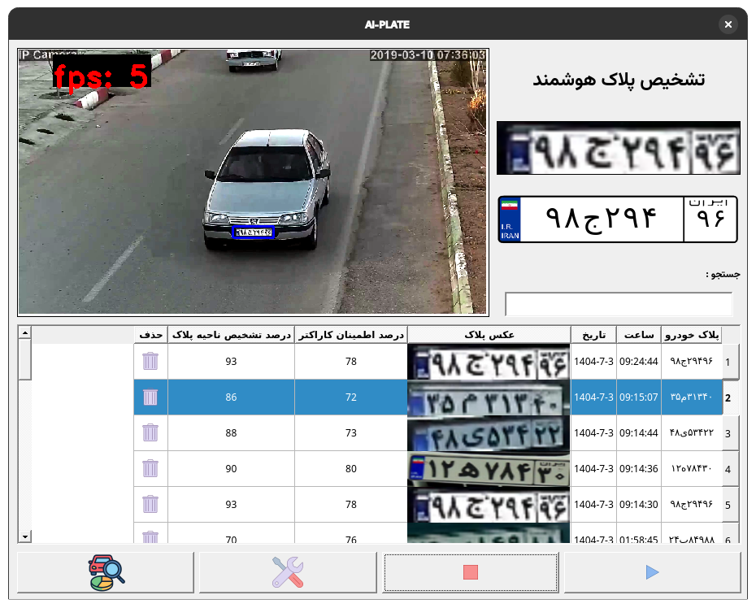
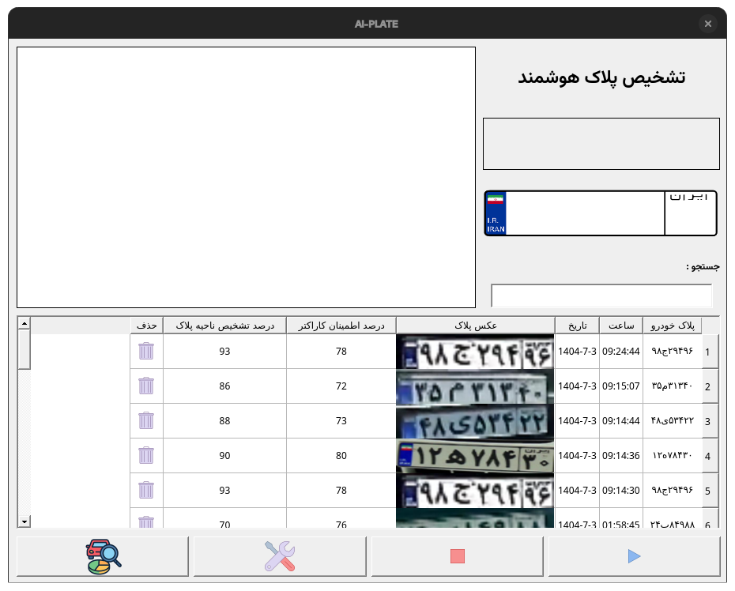
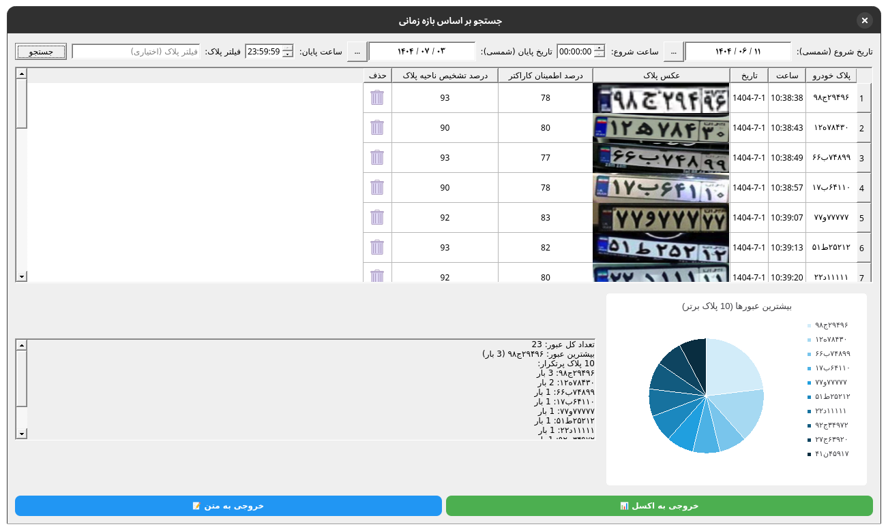

<div align="center">

# 🚘 AI-PLATE | پلاک‌بین  
### سیستم هوشمند تشخیص پلاک خودروهای ایرانی مبتنی بر یادگیری عمیق و پردازش تصویر  
**احسان خدادوست – پروژه کارشناسی دانشگاه بزرگمهر قائنات**

---

</div>

## 📖 معرفی
**AI-Plate** نرم‌افزاری است که با استفاده از مدل‌های **YOLOv5** و فریم‌ورک **PyTorch**، پلاک خودروهای ایرانی را از تصاویر و ویدیوها تشخیص می‌دهد.  
این پروژه با رابط گرافیکی **PySide6 (Qt)** طراحی شده و امکان جستجو، ثبت و خروجی‌گیری از داده‌ها را فراهم می‌کند.

---

## 🧠 ویژگی‌ها
- تشخیص پلاک با دقت بالا با استفاده از مدل‌های YOLOv5  
- پشتیبانی از **حروف فارسی** و **تاریخ شمسی**  
- رابط کاربری کاربرپسند و راست‌به‌چپ (RTL)  
- ذخیره اطلاعات در پایگاه داده SQLite  
- خروجی‌گیری به فرمت Excel و متن  
- جستجوی پیشرفته و نمودار آماری پلاک‌ها  

---

## 🧩 ساختار پروژه

│

├── ai/ # الگوریتم‌ها و پردازش تصویر

├── database/ # پایگاه داده و توابع مدیریتی

├── gui/ # رابط کاربری و فایل‌های Qt

├── helper/ # ابزارهای کمکی

├── icons/ # آیکون‌ها و تصاویر

├── model/ # مدل‌های YOLOv5 آموزش‌دیده

├── temp/ # تصاویر ذخیره‌شده پلاک‌ها

├── home_yolo.py # فایل اصلی اجرا

├── config.ini # تنظیمات

└── README.md


---

## ⚙️ نصب و اجرا
```bash
# 1. نصب پیش‌نیازها
pip install -r requirements.txt

# 2. اجرای برنامه
python home_yolo.py
 ⚙️ نصب و اجرا
```


📚 کتابخانه‌های مورد استفاده

PyTorch

YOLOv5

PySide6

OpenCV

Pillow

Pandas

SQLite3

JDateTime

NumPy


🧪 نمونه تصاویر (Demo)










🧭 موارد استفاده

مدیریت پارکینگ

کنترل ترافیک

امنیت محیطی و نظارت بر تردد

تحلیل داده‌های ترافیکی


💡 نوآوری‌ها

پشتیبانی از تاریخ شمسی در UI

جلوگیری از ثبت پلاک تکراری با الگوریتم مشابهت

طراحی UI راست‌به‌چپ با آیکون‌های اختصاصی


🧱 محدودیت‌ها و پیشنهادات

حساسیت به کیفیت تصویر و نور محیط

پشتیبانی نکردن از چند دوربین همزمان
🔹 پیشنهاد: افزودن پردازش چندمنبعی و API اعتبارسنجی پلاک‌ها


📜 مجوز و اطلاعات

© 2025 دانشگاه بزرگمهر قائنات
پروژه کارشناسی: احسان خدادوست
استاد راهنما: دکتر غلامعلی‌نژاد
